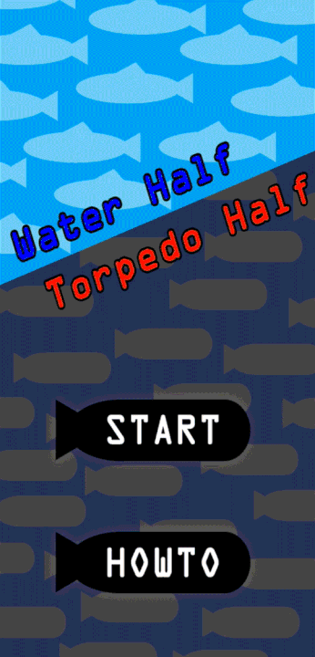
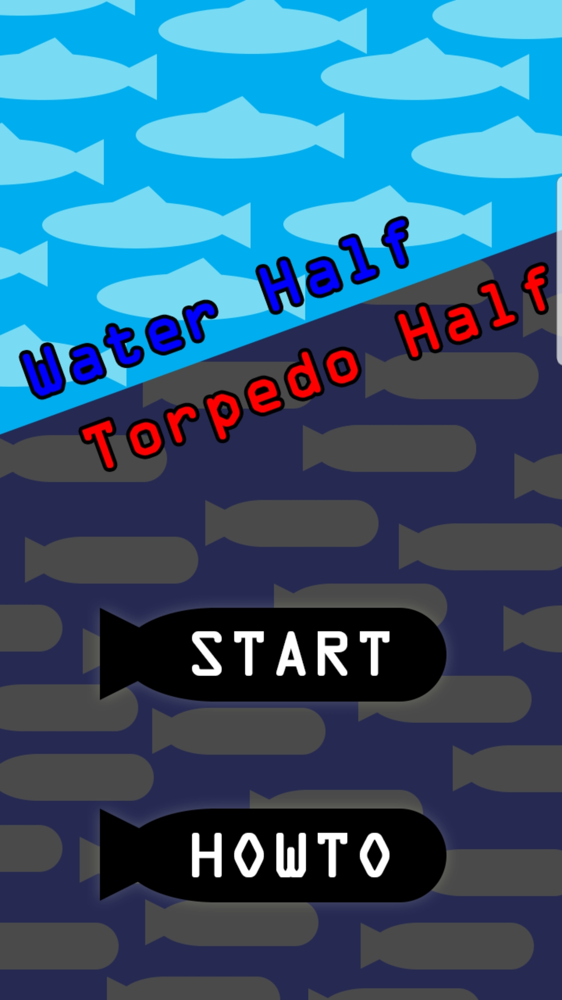
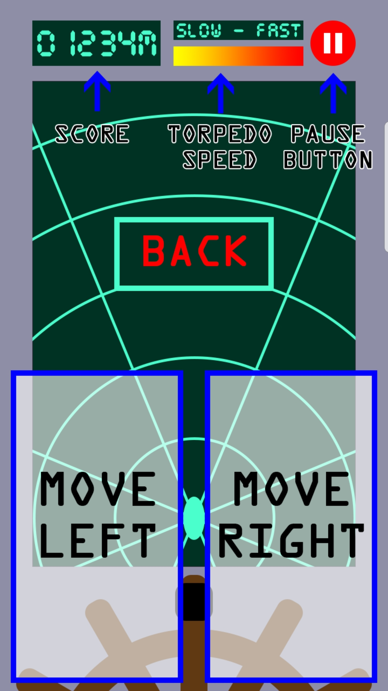
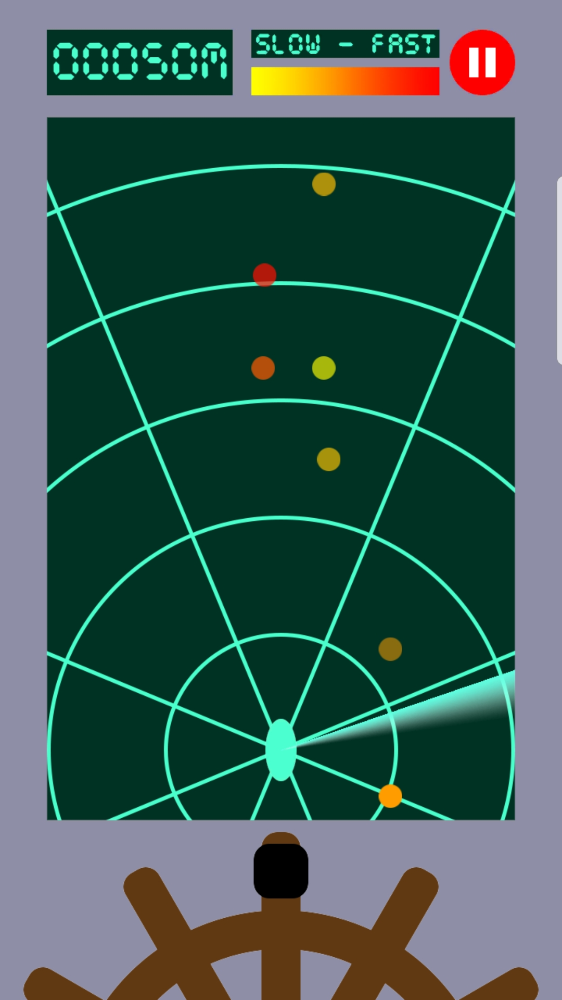
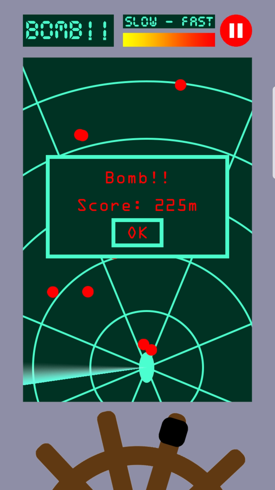

# Water Half Torpedo Half (물 반 어뢰 반)

## Introduction

You must avoid approaching torpedoes. There are many games of this genre. However, there is a distinction only in this game: The enemy's information is given **discontinuously**. You can only verify the position of the torpedo when the radar is passing by. You should anticipate and avoid the trajectory of a torpedo through color indicators that tell you the speed. It will allows you to experience that what is natural is not natural.

## Demo

## Screenshots

main | howto
:-------------------------:|:-------------------------:
 | 

playing | game over
:-------------------------:|:-------------------------:
 | 

## License

[MIT](https://github.com/ialy1595/Water-Half-Torpedo-Half/blob/master/LICENSE)
